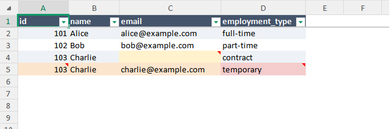
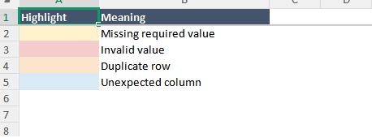
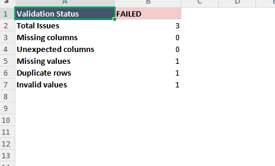
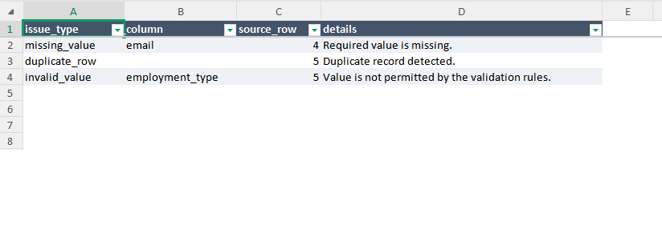

# Data Quality Toolkit

A lightweight Python command-line application for validating CSV and Excel datasets using reusable YAML rules.

Data Quality Toolkit is designed for practical spreadsheet and operational data QA. It detects common data-quality problems, produces structured QA reports, and can generate an annotated copy of an Excel workbook with problems highlighted directly in context.

> **Current release: v1.0.0**  
> **47 automated tests** covering file loading, validation, YAML configuration, reporting, Excel annotation, and CLI behaviour.

---

## Features

### Data Validation

- CSV and Excel (`.xlsx`) input
- Required-column validation
- Unexpected-column detection
- Missing-value detection
- Duplicate-row detection
- Duplicate detection using selected key columns
- Allowed-value validation
- Reusable YAML validation rules
- Source-file row numbers in reports

### Reporting

- Human-readable terminal output
- CSV issue reports
- Formatted Excel QA reports
- Summary and detailed issue sheets
- Meaningful CLI exit codes for scripting and automation

### Annotated Excel Workbooks

- Creates a reviewed copy without modifying the original workbook
- Missing required values highlighted in yellow
- Invalid values highlighted in red
- Duplicate rows highlighted in orange
- Unexpected columns highlighted in blue
- Cell comments explaining validation issues
- Specific cell-level problems override row-level highlighting
- Alternating row shading for readability
- Frozen header row
- Autofilters
- Automatic column sizing
- Built-in validation legend
- Gridlines removed for a cleaner review layout

### Development

- Installable Python package
- Production CLI command
- `pyproject.toml` packaging
- Automated `pytest` test suite
- Clean-clone installation verified

---

## Screenshots

### Annotated Workbook

The annotated workbook creates a review-ready copy of the original Excel file. Validation issues are highlighted directly in the data while preserving the source values.



A built-in legend explains the validation colours used in the reviewed workbook.



### Excel QA Report

The generated QA workbook provides both a high-level validation summary and a detailed issue list.

#### Summary

The Summary sheet shows overall validation status and issue counts.



#### Issues

The Issues sheet identifies each individual problem using its original source-file row number.



---

## Requirements

- Python 3.10 or newer
- pandas
- openpyxl
- PyYAML

Development additionally uses:

- pytest

---

## Installation

Clone the repository:

```bash
git clone https://github.com/d0suk0i/data-quality-toolkit.git
cd data-quality-toolkit
```

Create a virtual environment:

```bash
python -m venv .venv
```

### Windows PowerShell

```powershell
.\.venv\Scripts\Activate.ps1
```

### macOS / Linux

```bash
source .venv/bin/activate
```

Install the application:

```bash
pip install -e .
```

For development and testing:

```bash
pip install -e ".[dev]"
```

---

## Command-Line Interface

After installation, the application is available as:

```bash
data-quality
```

Show help:

```bash
data-quality --help
```

Show the installed version:

```bash
data-quality --version
```

The package can also be executed directly with Python:

```bash
python -m data_quality_toolkit --version
```

---

## Basic Usage

Validate that required columns exist and contain values:

```bash
data-quality data.csv --required id name email
```

Check for duplicates using a specific key:

```bash
data-quality data.csv --required id name email --duplicate-key id
```

A successful validation produces:

```text
Validation passed: no issues found.
```

A failed validation might produce:

```text
Validation failed:
Missing values in 'email': rows 4
Duplicate rows: 5
Invalid values in 'employment_type': rows 5
```

---

## YAML Configuration

Validation rules can be stored in a reusable YAML file instead of being entered manually each time.

Example:

```yaml
required_columns:
  - id
  - name
  - email
  - employment_type

expected_columns:
  - id
  - name
  - email
  - employment_type

duplicate_subset:
  - id

allowed_values:
  employment_type:
    - full-time
    - part-time
    - contract
```

Run validation with the included example configuration:

```bash
data-quality samples/sample_jobs.xlsx --config config/job_rules.yaml
```

This approach makes validation rules easy to review, reuse, and version alongside a workflow.

---

## Exporting QA Reports

### CSV Report

Export individual validation issues to CSV:

```bash
data-quality samples/sample_jobs.xlsx --config config/job_rules.yaml --output validation_report.csv
```

The report contains structured fields such as:

```text
issue_type
column
source_row
details
```

### Excel Report

Export a formatted Excel QA workbook:

```bash
data-quality samples/sample_jobs.xlsx --config config/job_rules.yaml --output validation_report.xlsx
```

The workbook contains:

- **Summary** — overall validation status and issue counts
- **Issues** — individual validation problems with source-file row numbers

---

## Annotated Excel Output

For `.xlsx` input files, the tool can create a reviewed copy of the original workbook:

```bash
data-quality samples/sample_jobs.xlsx --config config/job_rules.yaml --annotated-output reviewed_sample_jobs.xlsx
```

The original workbook remains unchanged.

The reviewed copy visually identifies:

- missing required values
- invalid values
- duplicate records
- unexpected columns

It also adds explanatory comments, formatting, filtering, row shading, and a legend.

---

## Combined Workflow

Validation, QA reporting, and workbook annotation can be performed in one command:

```bash
data-quality samples/sample_jobs.xlsx --config config/job_rules.yaml --output validation_report.xlsx --annotated-output reviewed_sample_jobs.xlsx
```

This:

1. Loads the source workbook
2. Applies the YAML validation rules
3. Prints the validation result to the terminal
4. Generates a structured Excel QA report
5. Creates an annotated review copy of the source workbook

---

## Exit Codes

The CLI uses meaningful exit codes so it can be incorporated into scripts and automated workflows.

| Exit Code | Meaning |
| --- | --- |
| `0` | Validation completed and no issues were found |
| `1` | Validation completed and data-quality issues were found |
| `2` | Validation could not complete because of invalid input, configuration, or file errors |

A validation result containing bad data is therefore distinct from an application error.

---

## Project Structure

```text
data-quality-toolkit/
├── config/
│   └── job_rules.yaml
│
├── docs/
│   └── images/
│       ├── annotated-legend.png
│       ├── annotated-workbook.png
│       ├── qa-report-issues.png
│       └── qa-report-summary.png
│
├── samples/
│   ├── sample_jobs.csv
│   └── sample_jobs.xlsx
│
├── src/
│   └── data_quality_toolkit/
│       ├── __init__.py
│       ├── __main__.py
│       ├── annotator.py
│       ├── cli.py
│       ├── config.py
│       ├── exporter.py
│       ├── loader.py
│       ├── report.py
│       ├── utils.py
│       └── validator.py
│
├── tests/
│   ├── test_annotator.py
│   ├── test_cli.py
│   ├── test_config.py
│   ├── test_exporter.py
│   ├── test_loader.py
│   ├── test_report.py
│   └── test_validator.py
│
├── .gitignore
├── LICENSE
├── pyproject.toml
└── README.md
```

---

## Testing

Install the development dependencies:

```bash
pip install -e ".[dev]"
```

Run the complete test suite:

```bash
python -m pytest -v
```

Version 1.0.0 currently includes **47 automated tests**.

The release was also verified using a fresh Git clone, new virtual environment, normal package installation, full test suite, and end-to-end Excel processing.

---

## Design Goals

The project intentionally focuses on lightweight local data QA rather than attempting to replace enterprise-scale data-quality platforms.

The main goals are:

- simple configuration
- readable output
- practical CSV and Excel workflows
- reusable validation logic
- useful output for non-developer spreadsheet users
- automation-friendly CLI behaviour
- maintainable and tested Python code

---

## Current Limitations

Version 1.0.0 currently focuses on straightforward local tabular-data workflows.

Notable limitations include:

- Excel annotation currently supports `.xlsx` files
- validation operates on the primary worksheet/data table
- validation rules are currently focused on schema, missing data, duplicates, and allowed values
- batch processing is not yet included

These are candidates for future versions rather than requirements for the initial release.

---

## Potential Future Improvements

Possible additions include:

- batch validation of multiple files
- multi-sheet Excel validation
- additional data-type and range rules
- regex-based validation
- date validation
- configurable numeric limits
- richer summary statistics
- additional report formats
- graphical user interface
- integration into automated data pipelines

---

## Version

**Data Quality Toolkit 1.0.0**

Release tag:

```text
v1.0.0
```

---

## License

This project is licensed under the **MIT License**.

See [LICENSE](LICENSE) for details.